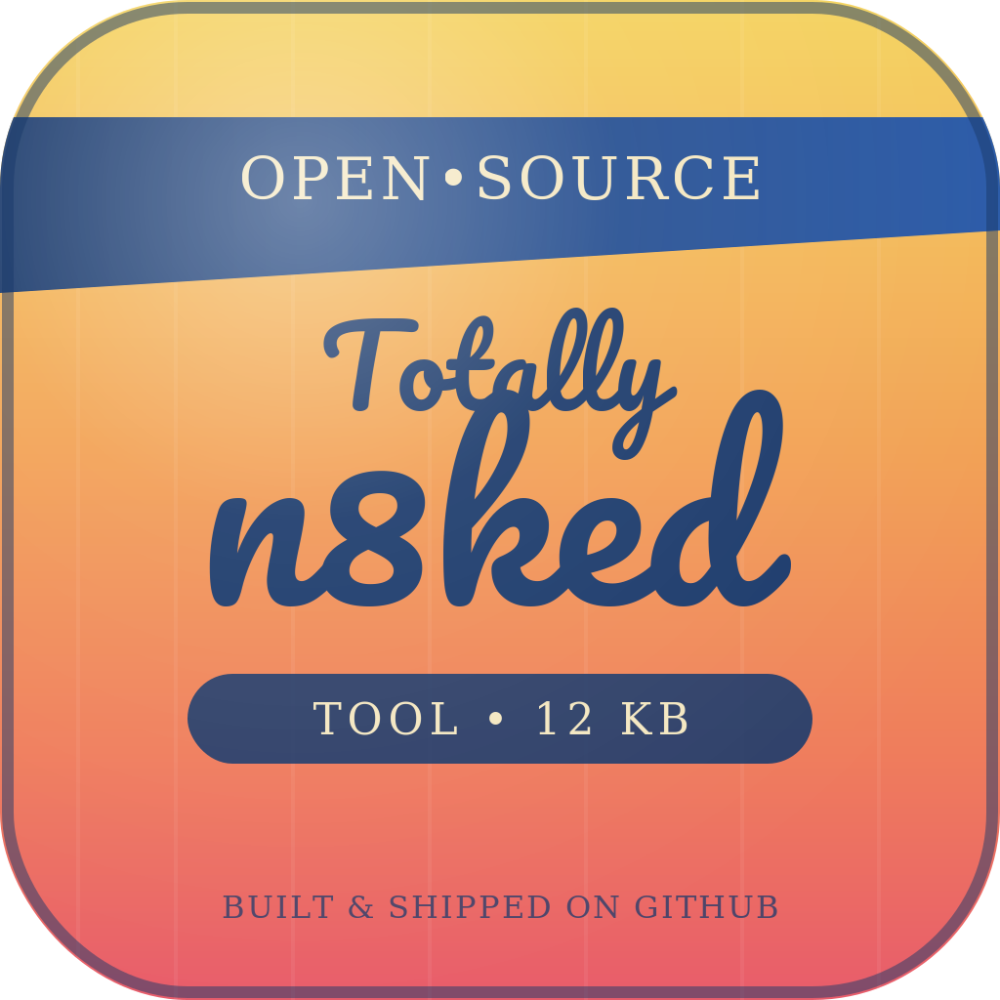

<div align="center">
<a href="https://blackhillsinfosec.com"></a>
<hr>
  <a href="https://github.com/blackhillsinfosec/n8ked/actions"></a>
  &nbsp;
  <a href="https://discord.com/invite/bhis"></a>
  &nbsp;
  <a href="https://github.com/her3ticAVI/n8ked/graphs/contributors"></a>
  &nbsp;
  <a href="https://x.com/BHinfoSecurity"></a>
  &nbsp;
  <a href="https://github.com/her3ticAVI/n8ked/stargazers"></a>

<p class="align center">
<h4><code>n8ked</code> is an unauthenticated exposure and misconfiguration auditor for <a href="https://n8n.io">n8n</a> instances found during external/internal recon. It starts from n8n's by-design unauthenticated endpoints, checks whether endpoints that shouldn't be reachable without a login actually are, and scans what comes back for hardcoded secrets — all read-only, no exploitation.</h4>
</p>

<div style="text-align: center;">
  <h4>
    <a target="_blank" href="#usage" rel="dofollow"><strong>Usage</strong></a>&nbsp;·&nbsp;
    <a target="_blank" href="#features" rel="dofollow"><strong>Features</strong></a>&nbsp;·&nbsp;
    <a target="_blank" href="#understanding-the-output" rel="dofollow"><strong>Understanding Output</strong></a>&nbsp;·&nbsp;
    <a target="_blank" href="#for-testers" rel="dofollow"><strong>For Testers</strong></a>&nbsp;·&nbsp;
    <a target="_blank" href="#scope-and-safety-notes" rel="dofollow"><strong>Scope &amp; Safety</strong></a>
  </h4>
</div>
<hr>
</div>

<div align="left">

## Why

Fingerprinting an n8n instance's version tells you if it's patched. It doesn't tell you whether someone left `/rest/workflows` reachable with no login and a hardcoded Slack token sitting in a node's parameters. This checks for that.

## Features

- **Instance fingerprint** — version, release channel, instance ID, auth method, SSO config, health status
- **MFA posture** — enabled vs. enforced, flagged separately (a lot of instances have MFA available but not required)
- **Access control sweep** — probes 9 sensitive REST/API endpoints unauthenticated:
  `/rest/workflows`, `/rest/credentials`, `/api/v1/workflows`, `/rest/users`, `/rest/executions`, `/rest/active-workflows`, `/rest/owner`, `/rest/community-packages`, `/metrics`
  Each gets a verdict: `PROTECTED`, `EXPOSED`, `NOT-ENABLED`, or `EMPTY` — with guards against false positives from SPA catch-all routing and n8n's `{"data": []}` empty-response envelope.
- **Secret scanning** — anything that comes back exposed is scanned for AWS keys, Slack tokens, JWTs, bearer tokens, PEM private key blocks, database connection strings, GitHub tokens, and generic password/secret/token fields. Matches are masked by default.
- **CORS check** — flags credentialed reflection of arbitrary `Origin` headers (a website can make authenticated requests on a logged-in victim's behalf)
- **Security headers** — HSTS, X-Frame-Options, X-Content-Type-Options, CSP, and whether the service is even on TLS
- **Config/file exposure** — checks for `.env`, `.git/config`, `.git/HEAD`, `package.json`, `docker-compose.yml`, `config.json`, with root-page diffing to avoid false positives on SPA fallback routing
- **Internal hostname disclosure** — pulls real internal hostnames leaked via OAuth/OIDC callback URLs, even when the instance is only reachable by IP
- **Single credential test** (`--test-cred`) — check exactly one pair against `/rest/login`, no wordlists, no spraying built in
- **Optional nuclei pass** (`--nuclei`) — runs nuclei's own signed `n8n`-tagged templates for known CVEs instead of any custom exploit logic
- **Multi-host** — scan a list of targets, or point it at an EyeWitness results folder and it'll find the n8n instances for you
- **Risk-scored output** — every finding gets Critical/High/Medium/Low, with a rollup summary and an exit code that reflects the worst finding

## Requirements

- `bash`, `curl`
- `jq` **or** `python3` (JSON parsing — jq preferred, python3 fallback)
- `python3` specifically needed for secret scanning and the EyeWitness HTML/CSV parser (falls back to a CSV-only parser without it)
- `nuclei` — only if you pass `--nuclei`

Tested on Kali; should run anywhere with a reasonably modern bash and GNU coreutils.

## Installation

```bash
git clone https://github.com/blackhillsinfosec/n8ked.git
cd n8ked
chmod +x n8ked.sh
```

No dependencies to install beyond what's already on a typical pentest box.

## Usage

```bash
./n8ked.sh <target> [options]
./n8ked.sh --file targets.txt [options]
./n8ked.sh --eyewitness /path/to/EyeWitness-Results [options]
```

### Examples

```bash
# Single host
./n8ked.sh http://10.0.0.5:5678

# Single host, with one credential to test
./n8ked.sh 10.0.0.5:5678 --test-cred admin@example.com:changeme

# List of hosts, JSON output piped to a file (one object per line)
./n8ked.sh --file scope-hosts.txt --json > results.jsonl

# Point it at an EyeWitness results folder — it finds the n8n instances for you
./n8ked.sh --eyewitness ~/engagements/acme/EyeWitness-Results

# Full secret values instead of masked previews
./n8ked.sh http://10.0.0.5:5678 --reveal-secrets

# Also run nuclei's n8n-tagged CVE templates
./n8ked.sh http://10.0.0.5:5678 --nuclei
```

### Options

| Flag | Description |
|---|---|
| `--file FILE` | Scan every host in `FILE`, one target per line (`#` comments allowed) |
| `--eyewitness DIR` | Pull candidate hosts from an EyeWitness results folder (`open_ports.csv` and/or `report*.html`), probe each for n8n, and only run the full audit against confirmed hits |
| `--json` | Output one JSON object per host instead of the pretty terminal report |
| `--test-cred user:pass` | Try exactly one credential pair against `/rest/login` |
| `--reveal-secrets` | Print full secret values instead of masked previews |
| `--nuclei` | Also run nuclei's `n8n`-tagged templates, if nuclei is installed |
| `--no-color` | Disable ANSI colors (useful when piping to a file) |
| `-h`, `--help` | Show usage |

## How the EyeWitness mode works

`--eyewitness` reads `open_ports.csv` and any `report*.html` files in the given folder, extracts every unique host origin EyeWitness recorded, and sends a lightweight unauthenticated probe (`GET /rest/settings`, checking for `instanceId`) to each one. Only confirmed n8n instances get the full audit — everything else is skipped silently, so you can point it at a folder with a hundred unrelated web hosts and it'll only spend real time on the ones that matter.

## Understanding the output

Each endpoint in the access control sweep gets one of four verdicts:

| Verdict | Meaning |
|---|---|
| `PROTECTED` | Returned 401/403 — access control is working |
| `EXPOSED` | Returned real data with no auth required — this is a finding |
| `EMPTY` | Reachable without auth but returned no meaningful data (e.g. no workflows exist yet) |
| `NOT-ENABLED` | 404, or the response was identical to the root SPA page (routing catch-all, not a real endpoint) |

Findings roll up into a severity-tagged summary at the end of each report:

- **Critical** — unauthenticated access to workflows/credentials/the public API, hardcoded secrets, credentialed CORS misconfiguration, valid tested credentials
- **High** — unauthenticated access to users/executions/active-workflow lists, plain HTTP with no TLS, setup wizard potentially still open
- **Medium** — unauthenticated metrics/owner endpoint exposure, possible config file exposure, MFA not enforced
- **Low** — missing security headers, internal hostname disclosure, wildcard (non-credentialed) CORS, live webhook-test endpoint

Exit codes: `0` = nothing Critical/High found on any target, `1` = at least one Critical/High finding, `2` = target(s) couldn't be confirmed as n8n.

## For Testers

### Report language

For write-ups, use something like the following in the methodology/tools section (edit to match what was actually run):

> n8ked was used to audit the n8n instance(s) in scope for unauthenticated exposure and misconfiguration. The tool issued read-only HTTP requests via curl against n8n's documented REST and API endpoints to determine whether access controls, MFA enforcement, CORS policy, and security headers were configured as expected, and inspected any data returned from unauthenticated requests for hardcoded secrets such as API keys, tokens, and credentials. Where nuclei was used, only official, signed `n8n`-tagged templates were run against known CVEs; no custom or hand-rolled exploit code was executed against the target(s). No authentication bypass, data modification, or exploitation was attempted at any point during this activity.

Adjust the language if `--test-cred` or `--nuclei` weren't used on a given engagement, since both are optional and each carries its own disclosure implications (a credential test, however limited, is still an authentication attempt against the client's system).

### Defensability of n8ked
N8ked was created to audit n8n instances. This tool relies on data returned from multiple endpoints that self report information. Secrets that were matched by regex were also reported on. None of the information reported by the tool is presumed, and is only flagged if supporting information is returned by the n8n instance.

## Scope and safety notes

- Every check is a `GET` request except the optional `--test-cred`, which sends exactly one `POST /rest/login` with the credentials you supply — there is no wordlist or spray loop built in.
- Secret values are masked by default specifically so they don't end up on a shared screen or in a screenshot during report review; use `--reveal-secrets` deliberately when you need the real value.
- This tool identifies exposure and misconfiguration. It does not attempt exploitation of any CVE. If you want to check a specific CVE, use `--nuclei` (official, signed templates) rather than hand-rolled payloads.
- Use only against hosts you are authorized to test.

## Roadmap / ideas

- Normalize duplicate origins in `--eyewitness` mode (e.g. `host` and `host:80` currently probe separately)
- Optional concurrency for large `--file`/`--eyewitness` runs
- CSV output alongside `--json`

</div>

<hr>
<div align="center">
Made with ❤️ by The Heretic
</div>
